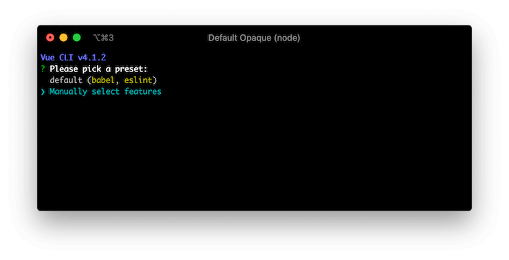

# 安装

## Vue CLI 安装

You can easily setup your Vue Class Component project by using [Vue CLI](https://cli.vuejs.org/). Run the following command to create a new project:

```sh
$ vue create hello-world
```

You will be asked whether using preset or not. Select "Manually select features":



Check TypeScript feature to use Vue Class Component. You can add other features in addition if you need:


Press `y` for the question `Use class-style component syntax?`:


You can answer the remaining questions as your preferences. After finishing this setup process, Vue CLI creates a new project directory with Vue Class Component installed.

## 手动安装

如果你喜欢手动设置，请通过npm安装它并配置你的构建工具。

### npm

你可以使用`npm`命令安装`Vue Class Component`。 请确保已经安装了`Vue`核心库，因为`Vue Class Component`依赖它：

```sh
$ npm install --save vue vue-class-component
```

如果你更喜欢`yarn`也可以用`yarn`命令来安装:

```sh
$ yarn add --save vue vue-class-component
```

### Build Setup

To use Vue Class Component, you need to configure [TypeScript](https://www.typescriptlang.org/) or [Babel](https://babeljs.io/) in your project as it relies on [ECMAScript stage 1 decorators](https://github.com/wycats/javascript-decorators/blob/master/README.md) which is needed to transpile to run on browsers.

::: warning
它不支持 stage 2 装饰器，因为TypeScript Transpiler现在仅支持旧的装饰器规范。
:::

#### TypeScript

Create `tsconfig.json` on your project root and specify `experimentalDecorators` option so that it transpiles decorator syntax:

```json
{
  "compilerOptions": {
    "target": "es5",
    "module": "es2015",
    "moduleResolution": "node",
    "strict": true,
    "experimentalDecorators": true
  }
}
```

#### Babel

安装 `@babel/plugin-proposal-decorators` 和 `@babel/plugin-proposal-class-properties`:

```sh
$ npm install --save-dev @babel/plugin-proposal-decorators @babel/plugin-proposal-class-properties
```

然后在你的根目录下配置 `.babelrc`文件：

```json
{
  "plugins": [
    ["@babel/proposal-decorators", { "legacy": true }],
    ["@babel/proposal-class-properties", { "loose": true }]
  ]
}
```

Note that `legacy` and `loose` option are needed as Vue Class Component only supports stage 1 (legacy) decorator spec yet.

## CDN

[unpkg.com](https://unpkg.com/) provides npm-based CDN links. You can choose specific version of Vue Class Component by replacing the `@latest` part in url (e.g. `https://unpkg.com/vue-class-component@7.2.2/dist/vue-class-component.js` to use version 7.2.2).

```html
<!-- UMD build -->
<script src="https://unpkg.com/vue-class-component@latest/dist/vue-class-component.js"></script>

<!-- UMD minified build -->
<script src="https://unpkg.com/vue-class-component@latest/dist/vue-class-component.min.js"></script>

<!-- ES Module build -->
<script src="https://unpkg.com/vue-class-component@latest/dist/vue-class-component.esm.browser.js"></script>

<!-- ES Module minified build -->
<script src="https://unpkg.com/vue-class-component@latest/dist/vue-class-component.esm.browser.min.js"></script>
```

## Different Builds

Vue Class Component is provided as different builds for different environments and usages.

- **For development**
  - `vue-class-component.js` (UMD)
  - `vue-class-component.common.js` (CommonJS)
  - `vue-class-component.esm.js` (ES Module for bundlers)
  - `vue-class-component.esm.browser.js` (ES Module for browsers)
- **For production (minified)**
  - `vue-class-component.min.js` (UMD)
  - `vue-class-component.esm.browser.min.js` (ES Module for browsers)
